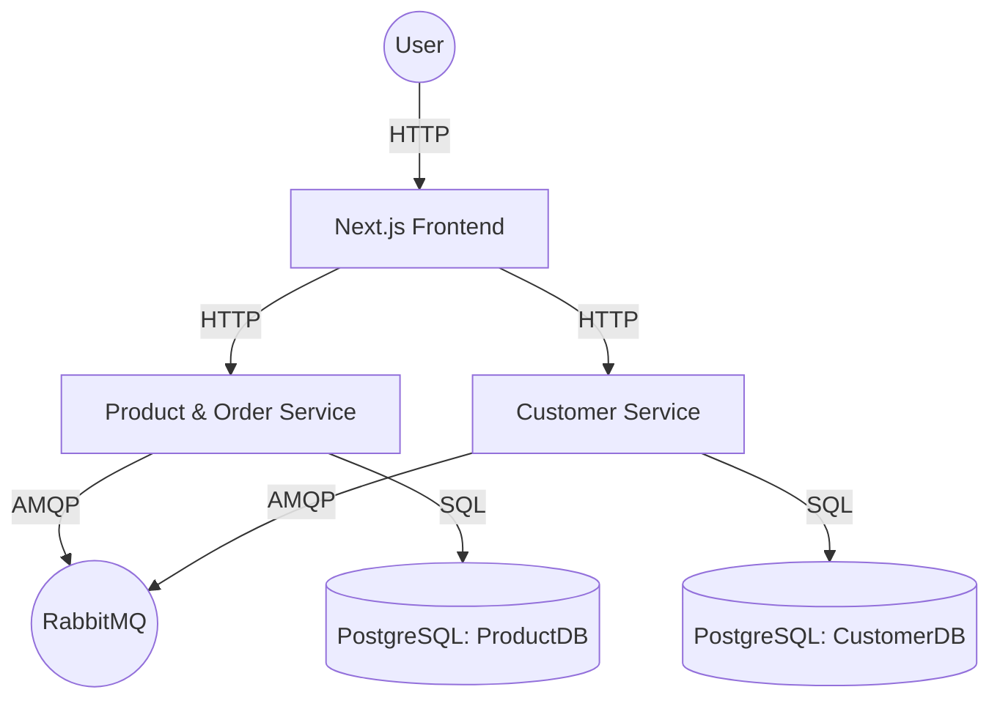

# E-Commerce Microservices Application

A robust, scalable e-commerce platform built with a microservices architecture. This project demonstrates a modern full-stack application using **NestJS** for backend services, **Next.js** for the frontend, **PostgreSQL** for data persistence, and **RabbitMQ** for asynchronous communication.

## 🚀 Quick Start

The easiest way to run the entire application is using the provided PowerShell script.

### One-Click Startup
1.  Open a PowerShell terminal in the root directory.
2.  Run the start script:
    ```powershell
    .\start-all.ps1
    ```
    This script will:
    - Start PostgreSQL and RabbitMQ containers via Docker Compose.
    - Open separate windows to start the Customer Service, Product & Order Service, and Frontend.

### Manual Startup
If you prefer to start services individually:

1.  **Infrastructure**: `docker-compose up -d`
2.  **Product Service**: `cd product-order-service/product-order-service` -> `npm start`
3.  **Customer Service**: `cd customer-service/customer-service` -> `npm start`
4.  **Frontend**: `cd frontend/ecommerce-frontend` -> `npm run dev`

Access the frontend at: [http://localhost:3000](http://localhost:3000)

---

## 🏗️ Architecture

The system is divided into three main components:



## 📂 Project Structure & File Explanation

This project is organized as a monorepo containing all services.

```
newEcom/
├── start-all.ps1                  # Automation script to launch all services
├── docker-compose.yml             # Docker config for Postgres & RabbitMQ
├── postman_collection.json        # API collection for testing
│
├── product-order-service/         # 📦 Microservice: Products & Orders
│   └── product-order-service/
│       ├── src/
│       │   ├── product/           # Product Module (Controller, Service, Entity)
│       │   │   ├── product.controller.ts  # Handles HTTP requests for products
│       │   │   ├── product.service.ts     # Business logic for products
│       │   │   └── product.entity.ts      # Database schema definition
│       │   ├── order/             # Order Module
│       │   │   ├── order.controller.ts    # Handles HTTP requests for orders
│       │   │   └── order.service.ts       # Order processing logic
│       │   ├── database/          # Database connection setup
│       │   └── rabbitmq/          # Messaging configuration
│       ├── .env                   # Environment variables (DB creds, etc.)
│       └── package.json           # Dependencies (NestJS, TypeORM, pg)
│
├── customer-service/              # 👤 Microservice: Customer Management
│   └── customer-service/
│       ├── src/
│       │   ├── customer/          # Customer Module
│       │   │   ├── customer.controller.ts # API endpoints for customers
│       │   │   └── customer.service.ts    # Customer logic
│       │   └── ...
│       └── ...
│
└── frontend/                      # 💻 Frontend: User Interface
    └── ecommerce-frontend/
        ├── app/                   # Next.js App Router
        │   ├── page.tsx           # Home page (Product Listing)
        │   ├── checkout/          # Checkout page route
        │   │   └── page.tsx
        │   ├── components/        # Reusable UI Components
        │   │   ├── Navbar.tsx     # Navigation bar
        │   │   ├── ProductCard.tsx# Display for individual products
        │   │   ├── Cart.tsx       # Shopping cart sidebar
        │   │   └── SuccessModal.tsx # Order confirmation popup
        │   ├── api/               # API Integration Layer
        │   │   ├── productService.ts  # Calls Product Service
        │   │   └── customerService.ts # Calls Customer Service
        │   └── layout.tsx         # Main application layout (wraps all pages)
        ├── public/                # Static assets (images, icons)
        └── tailwind.config.ts     # Styling configuration
```

## 🛠️ Technologies & Tools

### Backend (NestJS)
-   **NestJS**: A progressive Node.js framework for building efficient, scalable server-side applications. Used for its modular architecture and TypeScript support.
-   **TypeORM**: An Object-Relational Mapper (ORM) used to interact with the PostgreSQL database using TypeScript classes instead of raw SQL.
-   **PostgreSQL**: A powerful, open-source relational database system. We use two isolated instances to simulate a true microservices data separation.
-   **RabbitMQ**: A message broker used for asynchronous communication between services (e.g., updating inventory when an order is placed).

### Frontend (Next.js)
-   **Next.js 15**: The React framework for the web. We use the **App Router** for modern routing and server-side rendering capabilities.
-   **TypeScript**: Ensures type safety across the entire application, reducing bugs and improving developer experience.
-   **Tailwind CSS**: A utility-first CSS framework for rapidly building custom user interfaces without leaving your HTML.
-   **Axios**: A promise-based HTTP client for making requests to our backend microservices.

### Infrastructure
-   **Docker & Docker Compose**: Used to containerize and orchestrate the database and message broker services, ensuring a consistent environment across different machines.

